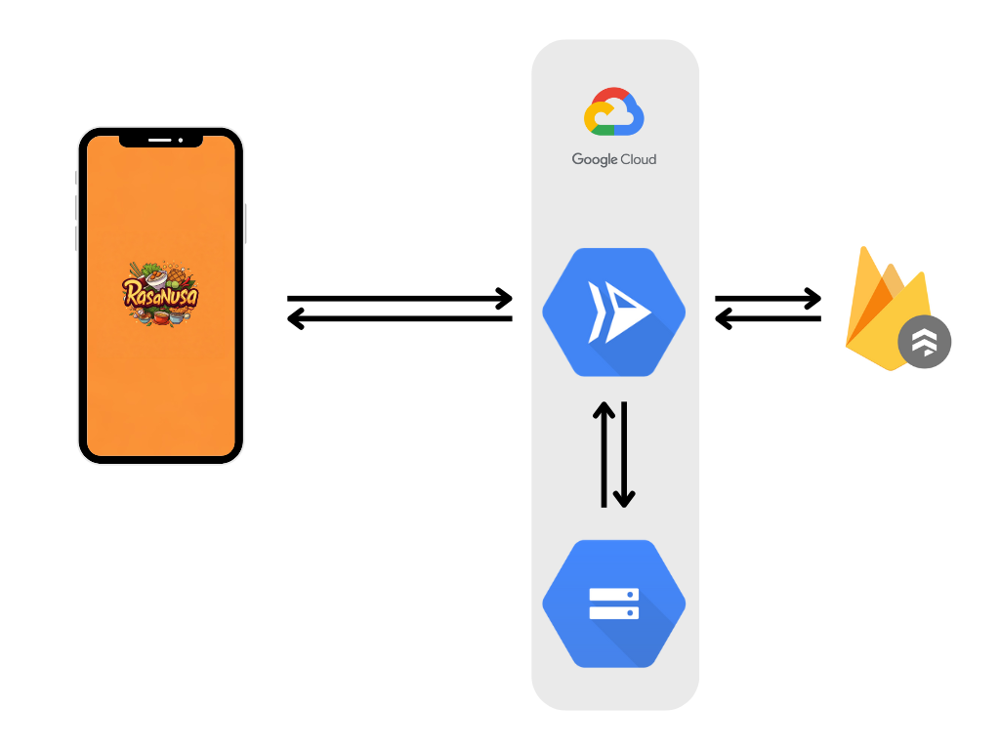

# **RasaNusa API Documentation**

## **URL**
* RasaNusa API Base URL
    ```json
        https://rasanusa-api-555896629878.asia-southeast2.run.app
    ```

---

## **Root Endpoint**
- **Endpoint:** `/`
- **Method:** `GET`
- **Description:** Endpoint dasar untuk memastikan API berjalan.
- **Response:**
    ```json
    {
        "status": "success",
        "message": "RasaNusa API is running..."
    }
    ```

---

## **Register**
- **Endpoint:** `/register`
- **Method:** `POST`
- **Description:** Mendaftarkan pengguna baru.
- **Request Body (JSON):**
    ```json
    {
        "email": "string",
        "password": "string",
        "username": "string"
    }
    ```
- **Successful Response:**
    ```json
    {
        "status": "success",
        "message": "User registered successfully",
        "uid": "string"
    }
    ```
- **Error Response:**
    ```json
    {
        "status": "fail",
        "message": "string"
    }
    ```

---

## **Predict**
- **Endpoint:** `/predict`
- **Method:** `POST`
- **Description:** Mengunggah gambar dan mendapatkan prediksi makanan.
- **Form Data:**
    - `image` (*file*) - Gambar makanan.
- **Successful Response:**
    ```json
    {
        "status": "success",
        "predicted_class": "string",
        "confidence": ">= 75%",
        "image_url": "gs://<bucket-name>/<path-to-image>",
        "document_data": {
            "key": "value"
        }
    }
    ```
- **Response untuk Gambar Tidak Dikenali:**
    ```json
    {
        "status": "fail",
        "message": "Image not recognized. Please try with a clearer image.",
        "predicted_class": "unknown"
    }
    ```
- **Error Response:**
    ```json
    {
        "status": "fail",
        "message": "string"
    }
    ```

---

## **Result**
- **Endpoint:** `/result`
- **Method:** `GET`
- **Description:** Mengambil hasil prediksi terakhir.
- **Successful Response:**
    ```json
    {
        "status": "success",
        "data":
        {
            "key": "value"
        }
    }
    ```
- **Error Response:**
    ```json
    {
        "status": "fail",
        "message": "No prediction result found. Please perform a prediction first.",
    }
    ```

---

## **Result Field**
- **Endpoint:** `/result/<field>`
- **Method:** `GET`
- **Description:** Mengambil detail spesifik dari hasil prediksi terakhir.
- **Path Parameter:**
    - `<field>` (*string*) - Nama field yang ingin diambil dari hasil prediksi.
- **Successful Response:**
    ```json
    {
        "status": "success",
        "<field>": "value"
    }
    ```
- **Error Response:**
    ```json
    {
        "status": "fail",
        "message": "Field '<field>' not found"
    }
    ```

---

## **4. Dapatkan semua dokumen makanan**
- **Endpoint:** `/makanan`
- **Method:** `GET`
- **Description:** Mengambil data lengkap dari keseluruhan dokumen makanan di collection Firestore.
**Successful Response:**
  ```json
  {
    "status": "success",
    "data": [
      {
        "key": "value"
        // ... other fields
      },
      {
        "key": "value"
        // ... other fields
      },
      // ... other food documents
    ]
  }
  ```

---

## **5. Dokumen Makanan Lengkap**
- **Endpoint:** `/makanan/<doc_id>`
- **Method:** `GET`
- **Description:** Mengambil data lengkap dari satu dokumen makanan di Firestore.
- **Path Parameter:**
    - `<doc_id>` (*string*) - ID dokumen makanan.
- **Successful Response:**
    ```json
    {
        "status": "success",
        "data": {
            "key": "value"
        }
    }
    ```
- **Error Response:**
    ```json
    {
        "status": "fail",
        "message": "Document '<doc_id>' not found"
    }
    ```

---

## **6. Field Spesifik dari Dokumen Makanan**
- **Endpoint:** `/makanan/<doc_id>/<field>`
- **Method:** `GET`
- **Description:** Mengambil field spesifik dari dokumen makanan di Firestore.
- **Path Parameters:**
    - `<doc_id>` (*string*) - ID dokumen makanan.
    - `<field>` (*string*) - Nama field yang ingin diambil.
- **Successful Response:**
    ```json
    {
        "status": "success",
        "<field>": "value"
    }
    ```
- **Error Response:**
    ```json
    {
        "status": "fail",
        "message": "Field '<field>' not found in document '<doc_id>'"
    }
    ```

---

## **Additional Notes**
- Semua data yang dikembalikan dari Firestore akan berbentuk JSON.
- Gambar yang diunggah akan disimpan di Google Cloud Storage dengan URL berbentuk `gs://<bucket-name>/<path>`.
- Prediksi "unknown" diberikan jika confidence hasil prediksi kurang dari 75%.
